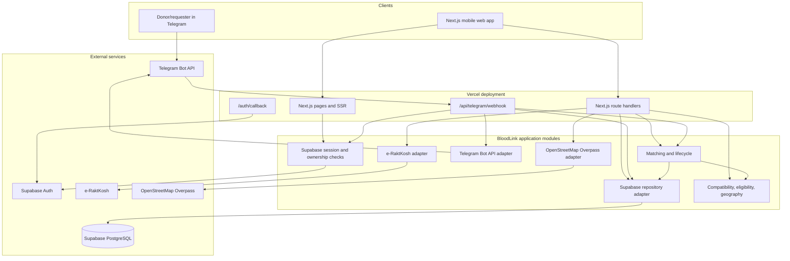
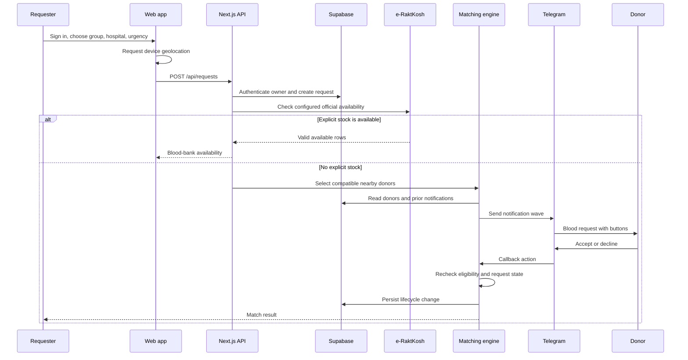

# BloodLink

BloodLink is a **Telegram-first blood-donor coordination system**. Its purpose is to help a person who needs blood reach compatible, nearby, consented donors quickly. The web application collects structured information and location permission; Telegram is the communication layer used to guide donors and requesters, collect donor details, and deliver time-sensitive match notifications.

BloodLink does **not** hold blood inventory, guarantee that a donor is medically eligible, replace a hospital or blood bank, or expose a public donor directory. It coordinates people and providers; medical decisions remain with the donor, requester, hospital, and authorized healthcare professionals.

## 1. What the project does

The system has two connected user journeys.

### Requester journey

Someone who needs blood:

1. Opens the mobile-first website and signs in with Supabase Auth.
2. Chooses a recipient blood group, units, urgency, and hospital.
3. Allows browser geolocation. Latitude and longitude are obtained from the device rather than typed into a form.
4. Chooses a nearby hospital from the OpenStreetMap-powered hospital list, when results are available.
5. Creates a blood request in Supabase.
6. Receives official blood-bank availability when the configured e-RaktKosh adapter returns an explicitly available result.
7. If no explicit blood-bank stock is available, starts the compatible-donor matching flow.
8. Waits for donor responses delivered through Telegram.

### Donor journey

Someone who wants to donate:

1. Opens the website or Telegram bot.
2. Selects **I want to donate blood**.
3. Provides their name, email, blood group, and last donation date.
4. Shares location through the browser or Telegram location button.
5. Chooses whether they agree to receive donor notifications.
6. Gets a Telegram link or remains in Telegram for future communication.
7. Receives a nearby compatible request with donor-friendly details.
8. Uses **Accept** or **Decline** buttons.

The system never publishes a donor's contact information in a public list. Contact exchange is a consequence of an accepted match, not a search feature.

## 2. Scope

### In scope

- Mobile-first donor and requester web flows
- Supabase email/password, magic-link, and Google sign-in
- Direct donor registration inside Telegram
- Telegram commands, menus, inline buttons, and reply keyboards
- Browser and Telegram location capture
- Nearby hospital discovery
- e-RaktKosh availability lookup through a guarded server adapter
- Blood-group compatibility and donor eligibility rules
- Distance-based notification waves
- Donor consent, availability, cooldown, and duplicate-contact filtering
- Accept/decline match lifecycle
- Secure, short-lived, hashed notification action tokens
- Supabase persistence and Row Level Security policies

### Not in scope

- Operating a blood bank or maintaining inventory
- Medical screening or clinical eligibility decisions
- Emergency dispatch, ambulance services, or hospital admission
- Public donor search or unrestricted contact sharing
- Guaranteed delivery of blood
- Replacing local blood-bank, hospital, or government procedures

## 3. Technical architecture



### Service responsibilities

| Service/module | Responsibility | Connection |
| --- | --- | --- |
| Next.js 16 on Vercel | Web pages, SSR, API routes, Telegram webhook | Browser and Telegram call Vercel |
| React 19 | Interactive donor/requester forms | Runs in the browser |
| Supabase Auth | Email/password, magic link, Google OAuth, sessions | Browser/SSR clients and callback route |
| Supabase PostgreSQL | Donors, requests, notifications, links, conversations | Server-only repository adapter |
| Supabase RLS | Database-level ownership policies | Applied by SQL migrations |
| Telegram Bot API | Communication layer, menus, buttons, notifications | Called only by `lib/telegram.ts` |
| e-RaktKosh | External blood-bank availability source | Called server-side by `lib/raktkosh.ts` |
| OpenStreetMap Overpass | Nearby named hospital lookup | Called server-side by `lib/hospitals.ts` |
| Zod | Request payload validation | Used in route handlers |
| Vitest | Rule and Telegram behavior tests | Local/CI test command |

### Why Telegram-first?

The website is the structured data and authentication surface. Telegram is the communication surface:

- Donors may register without navigating through the website.
- Requesters and donors receive familiar chat-based prompts.
- Blood group, consent, and accept/decline choices use buttons instead of ambiguous free text.
- Telegram location sharing avoids asking people to type latitude and longitude.
- Notifications reach donors in the channel where they already communicate.

Telegram is not the database and is not trusted as an identity store by itself. Conversation state is persisted in Supabase, and server-side handlers validate every update and action.

## 4. End-to-end request lifecycle



## 5. Implemented feature inventory

### Website

- Responsive mobile-first landing page.
- Separate donor and requester entry points.
- Telegram call-to-action linking directly to the configured bot.
- Supabase Auth page with:
  - email/password sign-in and registration;
  - magic-link sign-in;
  - Google OAuth;
  - visible signed-in state after callback.
- Donor profile form with:
  - name;
  - email;
  - blood group buttons/selectors;
  - native date picker;
  - date value preservation after validation errors;
  - browser location permission;
  - notification-consent agreement;
  - Telegram-link generation.
- Request form with:
  - blood group;
  - units;
  - urgency;
  - browser location;
  - nearby hospital dropdown;
  - loading, denied, retry, empty, and success states;
  - no manual latitude/longitude fields.
- Accessible focus states and touch-sized controls.
- Responsive navigation and account affordance.

### Telegram communication layer

- `/start` welcome flow.
- `/start <token>` donor-link flow.
- `/donate` direct donor-registration flow.
- `/help` usage guidance.
- `/status` current conversation/status response.
- `/cancel` conversation cancellation.
- `/disconnect` Telegram-link removal.
- Lazy `setMyCommands` and `setChatMenuButton` configuration.
- Inline buttons for:
  - donor/requester/help entry;
  - blood groups;
  - yes/no consent;
  - accept/decline notification actions.
- Reply keyboard for Telegram location sharing.
- Direct donor registration without redirecting to the website.
- Persisted conversation state for stateless Vercel functions.
- Malformed-update handling and structured server logging.
- Webhook secret validation outside mock mode.
- Deep-link token hashing and expiry.

### Matching and notification policy

The matching rules use red-cell compatibility and deterministic filters:

- compatible blood group;
- recorded donation interval of at least 90 days;
- notification consent;
- donor availability;
- paused-until status;
- active-match exclusion;
- valid location;
- distance radius;
- prior response to the same request;
- notification cooldown.

Notification waves are configured as:

| Wave | Maximum donors | Radius | Wait before next wave |
| --- | ---: | ---: | ---: |
| 1 | 5 | 3 km | 5 minutes |
| 2 | 10 | 5 km | 5 minutes |
| 3 | 20 | 10 km | 10 minutes |

Distance is calculated from browser/Telegram coordinates using the Haversine formula. Candidates are sorted by distance within a wave. Acceptance rechecks the request and donor before marking a match and expiring competing pending notifications.

### External data

- e-RaktKosh responses are parsed into a narrow availability shape.
- Only explicitly available blood-bank rows are returned.
- Invalid or unavailable provider responses fail closed.
- Nearby hospitals are retrieved within a 10 km search area.
- Hospitals are sorted by distance, capped, cached for five minutes, and returned only when they have a usable name.
- No hospital or blood-bank records are fabricated when an external service returns nothing.

## 6. Code organization

```text
app/
  page.tsx                         Landing page
  auth/page.tsx                    Auth UI
  auth/callback/route.ts           OAuth/magic-link callback
  donor/page.tsx                   Donor profile form
  request/page.tsx                 Blood request form
  api/donors/route.ts              Authenticated donor API
  api/requests/route.ts            Request creation and listing
  api/requests/[id]/match/route.ts Matching entry point
  api/notifications/accept/route.ts Notification action endpoint
  api/telegram/webhook/route.ts   Telegram update state machine
  api/hospitals/route.ts           Nearby hospital endpoint
  api/integrations/status/route.ts Integration diagnostics
app/styles.css                     Shared responsive visual system
lib/domain.ts                      Domain types and blood groups
lib/compatibility.ts               Red-cell compatibility
lib/eligibility.ts                 Donation interval rule
lib/geo.ts                          Distance calculation
lib/matching-config.ts             Radii, wave sizes, cooldown
lib/matching.ts                    Candidate selection and explanations
lib/match-lifecycle.ts             Accept/decline transitions
lib/notifications.ts               Notification creation and delivery
lib/telegram.ts                    Telegram Bot API adapter and keyboards
lib/telegram-registration.ts       DD/MM/YYYY normalization
lib/raktkosh.ts                    e-RaktKosh adapter
lib/hospitals.ts                   Overpass hospital adapter
lib/supabase/auth.ts               Request authentication
lib/supabase/server.ts             SSR/admin Supabase clients
lib/supabase/browser.ts            Browser Supabase client
lib/supabase/repository.ts         Persistence adapter
lib/store.ts                       Legacy demo/in-memory store
supabase/migrations/               Ordered schema and RLS migrations
tests/rules.test.ts                Matching rule tests
tests/telegram.test.ts             Telegram/date tests
docs/                              Architecture, security, and policy notes
```

## 7. Data and authentication model

The principal records are:

- **Donors**: identity/contact, blood group, location, last donation date, availability, notification consent, Telegram identity, and active-match state.
- **Blood requests**: requester, blood group, units, hospital, location, urgency, lifecycle status, and matched donor.
- **Notifications**: request/donor relationship, wave, pending/accepted/declined/expired state, timestamps, and hashed action-token material.
- **Telegram links**: short-lived hashed deep-link tokens used to connect a website donor to a Telegram chat.
- **Telegram conversations**: chat ID, current registration state, and temporary structured form data.

Route handlers derive the authenticated user from Supabase Auth. They do not accept a caller-supplied owner ID as authority. The service-role key is used only on the server and bypasses RLS, so route-level ownership checks are still required.

Apply migrations in this order:

```text
supabase/migrations/0001_bloodlink.sql
supabase/migrations/0002_supabase_auth.sql
supabase/migrations/0003_rls_policies.sql
supabase/migrations/0004_telegram_conversations.sql
```

## 8. Current persistence status

Donor creation, request creation, Telegram links, Telegram conversations, notification repository functions, and database schema are implemented. However, the current branch still has a legacy in-memory path in the matching route and parts of notification/match lifecycle code. This is documented intentionally:

- local demo behavior can use `lib/store.ts`;
- production serverless instances require the matching and notification path to use `lib/supabase/repository.ts`;
- until that migration is complete, matching state can be lost between instances or deployments.

This is the most important remaining architecture task. Do not describe the application as fully durable until it is completed and integration-tested.

## 9. Configuration and service setup

Copy the template:

```bash
cp .env.example .env.local
```

PowerShell:

```powershell
Copy-Item .env.example .env.local
```

| Variable | Purpose | Exposure |
| --- | --- | --- |
| `NEXT_PUBLIC_APP_URL` | Browser origin and Telegram deep links | Public |
| `NEXT_PUBLIC_SUPABASE_URL` | Supabase project URL | Public |
| `NEXT_PUBLIC_SUPABASE_PUBLISHABLE_KEY` | Browser/SSR client key | Public client key |
| `NEXT_PUBLIC_SUPABASE_ANON_KEY` | Legacy public-key fallback | Public client key |
| `SUPABASE_SERVICE_ROLE_KEY` | Server-side database operations | Secret |
| `TELEGRAM_BOT_TOKEN` | Telegram Bot API calls | Secret |
| `TELEGRAM_WEBHOOK_SECRET` | Telegram webhook verification | Secret |
| `TELEGRAM_BOT_USERNAME` | Deep-link username | Public |
| `MOCK_TELEGRAM` | Avoid real Telegram sends locally | Non-secret |
| `RAKTKOSH_ENDPOINT` | Official availability endpoint | Non-secret |
| `RAKTKOSH_STATE_CODE` | e-RaktKosh query value | Non-secret |
| `RAKTKOSH_DISTRICT_CODE` | e-RaktKosh query value | Non-secret |

### Google OAuth

In Supabase Auth, enable Google and set:

```text
https://<project-ref>.supabase.co/auth/v1/callback
```

In the app's Supabase URL configuration, allow:

```text
http://localhost:3000/auth/callback
https://bloodlink-ebon.vercel.app/auth/callback
```

The Google provider redirects to Supabase first; Supabase redirects to the app callback after exchanging the provider response.

### Telegram webhook

The production webhook is:

```text
https://bloodlink-ebon.vercel.app/api/telegram/webhook
```

The bot is configured by `lib/telegram.ts` and handled by `app/api/telegram/webhook/route.ts`. The bot's commands and menu are configured lazily when a real message is received. The Telegram conversation migration must be applied before using direct donor registration in a serverless deployment.

### Vercel

Vercel hosts the Next.js pages and route handlers. Configure all `.env.example` values in the correct Vercel environment, deploy, then point Supabase Auth and Telegram at the production URL.

```bash
pnpm install
pnpm build
vercel --prod
```

## 10. Local development and verification

Requirements: Node.js, pnpm, a Supabase project for real persistence, and optionally a Telegram bot.

```bash
pnpm install
pnpm dev
```

Open `http://localhost:3000`.

Validation commands:

```bash
pnpm test
pnpm exec tsc --noEmit
pnpm build
git diff --check
```

The test suite currently covers deterministic matching rules, compatibility, eligibility, Telegram date parsing, and Telegram interaction helpers. A disposable-Supabase integration suite is still recommended.

## 11. Security and operational rules

- Never commit `.env.local`, OAuth secrets, Supabase service-role keys, Telegram tokens, Vercel tokens, database dumps, `.next`, `node_modules`, or `.pnpm-store`.
- Do not expose the service-role key to browser bundles.
- Treat Telegram updates and provider responses as untrusted input.
- Validate ownership in route handlers even when RLS exists.
- Store notification action tokens as hashes; never log or return raw tokens.
- Keep provider calls server-side and timeout-protected.
- Do not present an empty provider response as confirmed availability.
- Add rate limiting, webhook update idempotency, audit logging, and delivery monitoring before treating the system as production-hardened.

See [`docs/security.md`](docs/security.md), [`docs/architecture.md`](docs/architecture.md), and [`docs/matching-rules.md`](docs/matching-rules.md) for the deeper technical references.

## 12. Known limitations and next work

1. Finish moving matching and notification lifecycle state from `lib/store.ts` to Supabase persistence.
2. Add idempotency for Telegram update IDs and webhook retries.
3. Add rate limiting for auth, donor registration, request creation, and Telegram actions.
4. Verify the e-RaktKosh endpoint and state/district parameters with real deployment data.
5. Add production monitoring for failed Telegram sends, provider timeouts, and abandoned conversations.
6. Add account/settings and phone-contact policy without exposing donor details.
7. Add integration tests covering Supabase Auth, RLS, matching persistence, and Telegram webhook retries.
