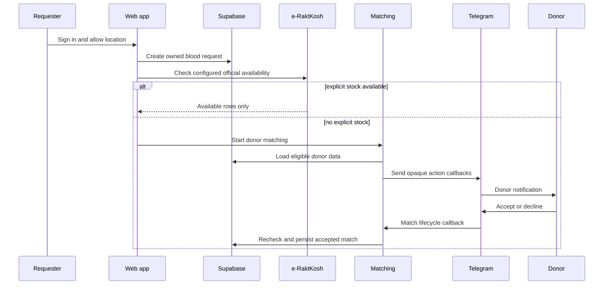

# Architecture reference

This document is the short technical map for maintainers and coding agents. The root README explains setup and product behaviour; this document explains seams, ownership, and lifecycle.

## System shape

```mermaid
flowchart TB
  UI[Next.js pages] --> Session[Supabase SSR session]
  UI --> DonorRoute[/api/donors]
  UI --> RequestRoute[/api/requests]
  RequestRoute --> HospitalAdapter[lib/hospitals.ts]
  RequestRoute --> RaktkoshAdapter[lib/raktkosh.ts]
  RequestRoute --> Repository[lib/supabase/repository.ts]
  TelegramAPI[Telegram Bot API] --> Webhook[/api/telegram/webhook]
  Webhook --> ConversationRepository[(telegram_conversations)]
  Webhook --> MatchLifecycle[lib/match-lifecycle.ts]
  MatchRoute[/api/requests/id/match] --> Matching[lib/matching.ts]
  Matching --> NotificationQueue[lib/notifications.ts]
  NotificationQueue --> TelegramAPI
  Repository --> Postgres[(Supabase PostgreSQL)]
```

## Seams and modules

### Authentication seam

- `lib/supabase/browser.ts` creates the browser client.
- `lib/supabase/server.ts` refreshes SSR cookies and reads the current user.
- `lib/supabase/auth.ts` accepts the request bearer token when present and otherwise uses the SSR cookie session.
- `middleware.ts` refreshes Auth cookies before route/page execution.
- `app/auth/callback/route.ts` exchanges the provider code for a session.

The interface for a route is: obtain a verified user or return `401`; never trust a user ID supplied in JSON.

### Persistence seam

- `lib/supabase/repository.ts` maps database rows to domain objects and centralizes reads/writes.
- `supabase/migrations/` defines the PostgreSQL schema and RLS history.
- The service-role client is server-only and bypasses RLS, so route ownership checks remain mandatory.

Donor and request creation currently use this seam. The matching route and parts of notification delivery still use the legacy in-memory store, which is the main architectural migration remaining.

### Matching seam

- `lib/compatibility.ts` answers blood-group compatibility.
- `lib/eligibility.ts` answers donation-interval eligibility.
- `lib/geolocation.ts` calculates distance.
- `lib/matching.ts` selects and explains candidates.
- `lib/match-lifecycle.ts` rechecks eligibility during acceptance and makes the match transition.

The match lifecycle must remain the source of truth for acceptance. A notification response cannot be treated as a match without rechecking the request, donor, consent, availability, and compatibility.

### Provider adapters

- `lib/telegram.ts` is the Telegram Bot API adapter.
- `lib/raktkosh.ts` is the official stock adapter.
- `lib/hospitals.ts` is the public nearby-hospital adapter.

Each adapter validates external input, times out, returns a narrow domain shape, and fails closed. Callers should not know provider response formats.

## Main lifecycle



## Change guide

- Change login/session behaviour in `lib/supabase/*`, `middleware.ts`, and `app/auth/*`.
- Change donor ownership or request ownership in the route handler and repository together.
- Change matching policy in the pure rule modules and `docs/matching-rules.md`; keep acceptance rechecks aligned.
- Change Telegram commands, buttons, or conversation states in the webhook plus `lib/telegram.ts` and the Telegram tests.
- Change provider parsing only inside the relevant adapter.
- Add schema changes as a new ordered SQL migration. Never edit an already-applied migration to change live schema.

## Testing strategy

- `tests/rules.test.ts` covers deterministic matching rules.
- `tests/telegram.test.ts` covers Telegram date normalization and interaction helpers.
- `pnpm exec tsc --noEmit` catches route/domain/repository contract drift.
- `pnpm build` catches App Router, server/client, and deployment compilation issues.

The next high-value test seam is an integration test for the persisted matching lifecycle, because that is where the current in-memory-to-Supabase migration is incomplete.
