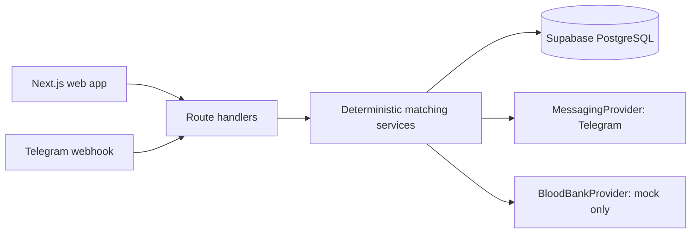

# BloodLink architecture

Requests start `OPEN`. A matching wave evaluates compatibility, recorded donation interval, consent, availability, radius, cooldown and prior responses. Only opaque notification action tokens reach Telegram. Acceptance rechecks all filters inside the current serialized lifecycle operation; it creates one match and expires outstanding notifications. Contact data is only returned after that state transition.

Demo mode is deliberately in-memory so it runs without secrets. The current route handlers still use that store, so the application is not production-ready. Migrations `0001`–`0003` define the intended Supabase schema and RLS boundary; a server-only Supabase repository must replace the demo store before deployment. Raktkosh is not connected and no blood-bank inventory is authoritative.
