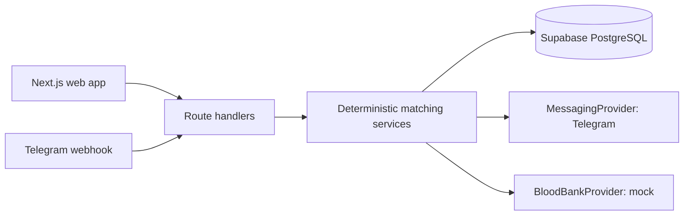

# BloodLink architecture

Requests start `OPEN`. A matching wave evaluates compatibility, recorded donation interval, consent, availability, radius, cooldown and prior responses. Only opaque notification action tokens reach Telegram. Acceptance rechecks all filters inside a transaction; it creates one match and expires outstanding notifications. Contact data is only returned after that state transition.

The current demo repository is deliberately in-memory so it runs without secrets. `supabase/migrations/0001_bloodlink.sql` is the production schema boundary. Replace the store adapter with a server-only Supabase repository before deployment.
